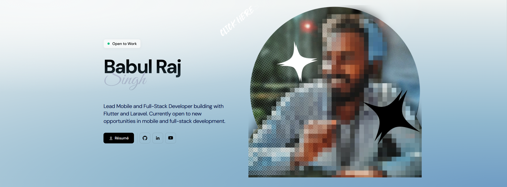

# Portfolio template

A single-page developer portfolio built with Next.js + Tailwind CSS.



## Setup

```bash
npm install
npm run dev
```

## Make it yours

1. Edit `data/demo_ba6ul.js` — swap in your name, title, bio, and social links.
2. Replace the placeholder images in `assets/images/` with your own photo.
3. Replace `ba6ul_resume_2026.pdf` with your own resume.

That's it — one file, one page.